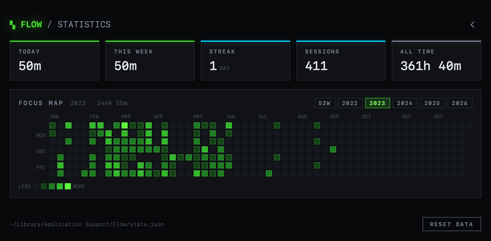

# Flow

A minimalist focus timer for macOS. Lives in the menu bar, counts down flow and
break phases, and records every focused minute into a heatmap.

Native SwiftUI + AppKit. No account, no network — stats are a single JSON file at
`~/Library/Application Support/Flow/stats.json`.



## Install

Download the DMG from [Releases](https://github.com/jashdubal/flow/releases/latest),
open it, drag **Flow** to Applications.

The app is ad-hoc signed, so Gatekeeper blocks the first launch. Right-click Flow
in Applications → **Open** → **Open**. macOS remembers the choice.

## Use

The menu bar shows an italic `ƒ` followed by the countdown. The mark is bright
while the timer runs and dim while it's paused.

| Click | Does |
| --- | --- |
| Left | Show / hide the window |
| Right | Start / pause |
| Control- or Option-click | Open the menu |

In the window: skip phase, reset, statistics and the menu across the top, space
bar to start and pause. The squares under the clock are the session ring — one
fills per completed flow phase.

The menu sets flow duration, break duration and session count (presets plus a
custom value), auto-start, sound, notifications, the menu-bar countdown, and
launch at login.

**Statistics** share the window: the ⊞ button expands it, the ‹ chevron collapses
it. Five tiles over the focus map, one cell per day, scaled against your best day.
The chips choose the span — `52W` is a rolling trailing year, and one chip per
year of data shows that calendar year.

## Build

Requires Xcode 15+ (Swift 5.9).

```sh
./scripts/build.sh          # -> dist/Flow.app, dist/Flow-1.0.0.dmg
VERSION=1.2.0 ./scripts/build.sh
swift run                   # quick debug run, unbundled
```

Universal binary (arm64 + x86_64). Pushing a `v*` tag builds the DMG and publishes
a release; `docs/` is the project site, deployed to GitHub Pages.

## Notes

Focus time is recorded second by second during flow phases only — breaks don't
count, and a phase abandoned halfway still banks the minutes actually done.

App and website blocking is not implemented. That needs a privileged helper and
network-extension entitlements, which require a paid Apple Developer account and a
notarized build.
